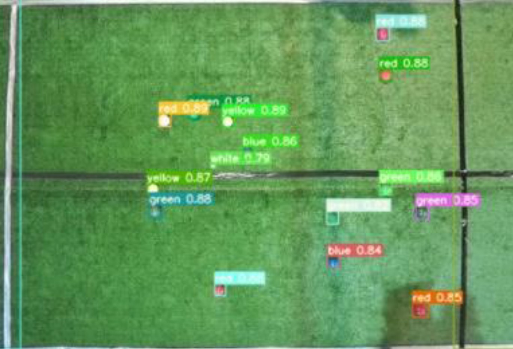

# boccoball-yolov5-detection

YOLOv5-based object detection system for the Bocco Ball game, designed to identify and classify various game elements such as colored balls and field lines with high precision and efficiency.

<p align="center">
  
</p>


## Features

- Detects and classifies:
  - White balls
  - Red balls
  - Green balls
  - Blue balls
  - Yellow balls
  - Vertical lines on the field
- Trained on a custom dataset to optimize detection accuracy for game analysis.

## Project Overview

This project implements object detection using YOLOv5 to analyze elements in the Bocco Ball game. The main objectives are:
1. Accurate detection of game components.
2. Efficient training and inference leveraging YOLOv5's state-of-the-art capabilities.

## Getting Started

### Prerequisites

- Python 3.8 or higher
- PyTorch 1.7 or higher
- [YOLOv5 dependencies](https://github.com/ultralytics/yolov5#requirements)

1. To train the YOLOv5 model on the dataset, run:

   ```bash
   python train.py --img 640 --batch 16 --epochs 150 --data data.yaml --cfg yolov5s.yaml --weights '' --name boccoball_detector

2. Evaluate the model's performance using:

    ```bash
   python val.py --data data.yaml --weights runs/train/boccoball_detector/weights/best.pt --img 640

Results
The model achieved the following metrics on the validation set:

- Precision: 95.6%
- Recall: 93.0%
- mAP@0.5: 94.1%
- mAP@0.5:0.95: 59.4%